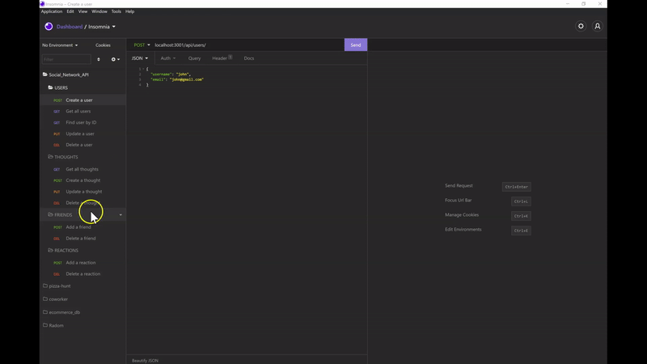

# Social Network API
       

## 📜 Description
API for a social network web application where users can share their thoughts, react to friends’ thoughts, and create a friend list.

## 📋 Table Of Contents

- [Installation](#%EF%B8%8F-installation)
- [Usage](#%EF%B8%8F-usage)
- [Walkthrough Video](#%EF%B8%8F-walkthrough-video)
- [Final Output GIF](#%EF%B8%8F-final-output-gif)
- [License](#-license)
- [Contributing](#-contributing)
- [Questions](#-questions)
  

## ⚙️ Installation

Please clone the repo, install mysql on your device and run the following command

```
npm install
```


## 🖥️ Usage

You need to setup the MongoDB database first, then run the following command

3. Start the server
```
npm start
```

## 🎞️ Walkthrough Video

[**Click Here**](https://www.youtube.com/watch?v=km8dgXSrI9s) to view the walkthrough video.

## ▶️ Final Output GIF




## 📝 License

This application is covered under the [MIT](https://choosealicense.com/licenses/mit/) license.


## 🤝 Contributing

Contributions, issues and feature requests are welcome. Feel free to check issues page if you want to contribute.


## ❓ Questions

If you have any questions regarding this application, please reach out via email or github!

📧 Email : pravton_dev@outlook.com

🤖 GitHub : https://github.com/pravton

